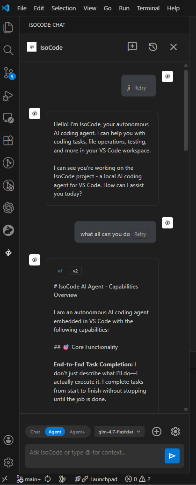

# IsoCode

**Local agentic AI coding assistant for VS Code.** ReAct-style agent that reads, edits, and runs tools in your workspace—runs on Ollama, LM Studio, or any OpenAI-compatible API. No cloud required.

[](https://opensource.org/licenses/MIT) [](https://code.visualstudio.com/) [](https://nodejs.org/)

---

## Screenshot & Demo

**IsoCode in VS Code — Chat, Agent, and Agent+**



**Demo video (≈1 min)** — 

  <video src="assets/IsoCode-demo.mp4" controls width="640"></video>

## What it does

IsoCode is a **local-first** coding agent inside VS Code. You get:

- **Chat** — Direct Q&A with your local model (streaming).
- **Agent** — Multi-step ReAct loop: plan → act (read/write files, search, shell, git, lint, test) → observe. Proposes file edits as diffs; you approve or reject.
- **Agent+** — Same agent with full autonomy: auto-applies edits, more steps, no approval prompts.

All inference runs on your machine (Ollama, LM Studio) or your own API key (OpenAI). The server and extension are open source; no telemetry, no locked-in cloud.

---

## Why IsoCode vs other AI IDEs

Many IDEs and coding assistants rely on **cloud APIs and API keys**: your code and requests go to third-party services, usage is metered, and you depend on their pricing and policies.

| | **IsoCode** | **Other AI IDEs (cloud / API-key based)** |
|---|-------------|------------------------------------------|
| **Where it runs** | VS Code (or any editor with the extension) | Often tied to a specific IDE or SaaS |
| **AI** | Your own models (Ollama, LM Studio) or your API key | Vendor’s cloud models; optional bring-your-own in some |
| **Cost** | Free (you pay for hardware or your own API if you choose) | Typically subscription or per-use API costs |
| **Privacy** | Code stays on your machine or your API; no required cloud | Code and prompts may be sent to vendor services |
| **Lock-in** | Open source; switch editors or models anytime | Tied to vendor product and pricing |

Use **IsoCode** when you want a local-first agent (plan → edit → approve) inside your editor, with no required subscription and no required cloud. Use other AI IDEs when you prefer their integrated experience and are fine with their API keys and data policies.

---

## Features

| Area | Details |
|------|---------|
| **Modes** | Chat (streaming), Agent (diff approval), Agent+ (autonomous) |
| **Tools** | `read_file`, `write_file`, `replace_in_file`, `apply_diff`, `codebase_search`, `search_files`, `list_files`, `glob_files`, `run_shell`, `run_lint`, `run_tests`, `git_status` / `git_diff` / `git_commit` / `git_log` / `git_branch`, `memory_read` / `memory_write`, browser (screenshot, click, type, extract), MCP tools |
| **Context** | Add files to context, @-mention, auto-gather from codebase; project rules from `.isocode/rules.md`, `AGENTS.md`, `.cursorrules` |
| **Stack** | Node.js server (Express) + VS Code extension (TypeScript); supports Ollama, LM Studio, OpenAI-compatible APIs |

---

## Requirements

- **Node.js** 18+
- **VS Code** 1.85+
- **LLM**: [Ollama](https://ollama.ai/) (e.g. `ollama pull qwen2.5-coder:7b`), [LM Studio](https://lmstudio.ai/), or any OpenAI-compatible endpoint

---

## Install

### 1. Clone and run the server

```bash
git clone https://github.com/rushi32/IsoCode.git
cd IsoCode
npm install
cp .env.example .env
# Edit .env if needed (LLM_API_BASE, LLM_MODEL_ID)
npm start
```

Server runs at `http://localhost:3000` by default.

### 2. Run the extension (development)

In a separate terminal:

```bash
cd IsoCode/extension
npm install
npm run compile
```

Open the `extension` folder in VS Code → press **F5** (Extension Development Host) → open the **IsoCode** sidebar from the activity bar.

### 3. Configure (optional)

- **Server:** `.env` — `LLM_API_BASE` (e.g. `http://localhost:11434/v1` for Ollama), `LLM_MODEL_ID`, `PORT`.
- **Extension:** VS Code Settings → search “IsoCode” — set **Server URL** if not `http://localhost:3000`.

---

## Usage

1. Open the IsoCode view (sidebar).
2. Choose **Chat**, **Agent**, or **Agent+**.
3. Select a model (dropdown; populated from your server).
4. Type your request. In Agent/Agent+ the assistant will plan, call tools, and (in Agent mode) propose diffs for you to approve.

Project-specific instructions: add `.isocode/rules.md` in your workspace. Optional MCP servers: configure in the extension settings or `.isocode/mcp-servers.json`.

---

## Project structure

```
IsoCode/
├── assets/              # Screenshot & demo video 
├── server/              # Agent server (Node)
│   ├── index.js         # HTTP + SSE
│   ├── agent.js         # ReAct loop
│   ├── tools.js         # Tool implementations
│   ├── llm.js           # Ollama / LM Studio / OpenAI
│   ├── config.js        # Env + user-config
│   └── ...
├── extension/           # VS Code extension
│   ├── src/             # TypeScript
│   ├── media/           # Webview UI, styles
│   └── package.json
├── .env.example
├── CONTRIBUTING.md
├── OPEN_SOURCE_GUIDE.md
└── LICENSE
```

---

## Docs

- [Contributing](CONTRIBUTING.md)
- [Publishing (GitHub, VS Code Marketplace)](OPEN_SOURCE_GUIDE.md)

---

## License

MIT. See [LICENSE](LICENSE).
